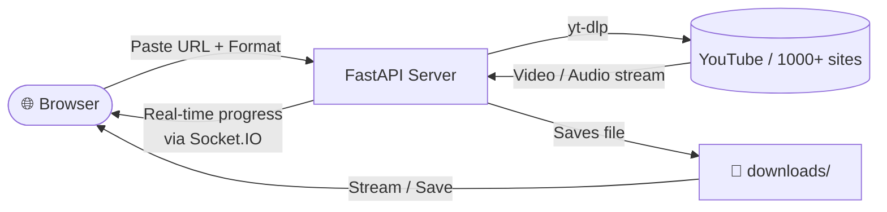

# yot_downloader

<p align="center">
  
</p>

<p align="center">
  A simple, fast, and self-hosted web application for downloading videos from YouTube and hundreds of other sites.<br>
  It provides a clean browser UI with real-time progress bars, audio notifications, and an instant file library to stream or save your videos.
</p>

---

## How It Works



---

## Features

- **One-click downloads** – paste any URL supported by [yt-dlp](https://github.com/yt-dlp/yt-dlp) and hit *Start Download*
- **Real-time progress bars** – live percentage, download speed, and ETA streamed to the browser via Socket.IO (no page refresh needed)
- **Multiple simultaneous downloads** – up to 3 concurrent downloads, each with its own progress card
- **Audio notifications** – distinct tones play when a download starts, completes, or fails (Web Audio API, no extra files required)
- **Format selection** – pass any yt-dlp format string (e.g. `best`, `bestvideo+bestaudio`, `mp3`)
- **Cookie support** – supply a cookies.txt path to access age-restricted or login-only content
- **File library** – all downloaded files are listed with name, size, and date; each file can be saved directly from the browser
- **Delete files** – remove downloaded files from the library with a single click
- **Live stats badge** – a persistent badge shows the total storage used
- **Toast notifications** – non-intrusive pop-up messages confirm every action
- **Connection indicator** – live dot shows WebSocket connection status
- **Rate limiting** – max 5 concurrent downloads per IP, max 3 system-wide
- **No playlist downloads** – `--no-playlist` is enforced so single-video URLs are never accidentally expanded

---

## Prerequisites

| Requirement | Version |
|-------------|---------|
| Python | 3.11 + |
| [yt-dlp](https://github.com/yt-dlp/yt-dlp) | latest recommended |
| ffmpeg *(optional)* | for merging video + audio streams |

---

## Installation

```bash
# 1. Clone the repository
git clone https://github.com/AllanRye9/yot_downloader.git
cd yot_downloader

# 2. Create and activate a virtual environment (recommended)
python -m venv venv
source venv/bin/activate   # Windows: venv\Scripts\activate

# 3. Install Python dependencies
pip install -r requirements.txt
```

---

## Usage

```bash
python api/app.py
```

The server starts at **http://127.0.0.1:5000** by default.

1. Open the URL in your browser.
2. Paste a video URL into the *Video URL* field.
3. *(Optional)* Change the **Format** string or provide a **Cookies** file path.
4. Click **Start Download**.
5. Watch the live progress bar and stats (speed / ETA) appear in the *Active Downloads* section.
6. A success tone plays and the file appears in the **Downloaded Videos** list when complete.
7. Click **Save** to download the file to your device, or the trash icon to delete it.

### Format examples

| Format string | Result |
|---------------|--------|
| `best` | Best single-file quality (default) |
| `bestvideo+bestaudio` | Best quality with ffmpeg merge |
| `bestvideo[height<=720]+bestaudio` | Cap at 720p |
| `bestvideo[height<=480]+bestaudio` | Cap at 480p |
| `mp3` | Audio only (requires ffmpeg) |
| `bestaudio` | Best audio stream |

---

## Docker

```bash
docker build -t yot_downloader .
docker run -p 5000:5000 yot_downloader
```

---

## Project Structure

```
yot_downloader/
├── api/
│   └── app.py          # Flask application & download logic
├── templates/
│   └── index.html      # Single-page frontend (HTML + CSS + JS)
├── downloads/          # Created automatically; stores downloaded files
├── requirements.txt    # Python dependencies
├── Dockerfile          # Docker build definition (uses Python 3.12)
└── README.md
```

---

## API Endpoints

| Method | Endpoint | Description |
|--------|----------|-------------|
| `GET` | `/` | Serves the main UI |
| `POST` | `/start_download` | Starts a download; returns `{"download_id": "..."}` |
| `GET` | `/status/<download_id>` | Returns status/progress for a specific download |
| `GET` | `/files` | Lists all files in the downloads folder |
| `GET` | `/active_downloads` | Returns active/queued downloads with progress details |
| `GET` | `/stats` | Returns file count, total size, and active download count |
| `GET` | `/downloads/<filename>` | Streams a downloaded file to the browser |
| `DELETE` | `/delete/<filename>` | Deletes a downloaded file |
| `POST` | `/cancel/<download_id>` | Cancels an ongoing download |
| `GET` | `/health` | Health check endpoint |

### Socket.IO events

| Direction | Event | Payload | Description |
|-----------|-------|---------|-------------|
| Server → Client | `progress` | `{id, line, percent, speed, eta, size}` | yt-dlp progress update |
| Server → Client | `completed` | `{id, filename, title}` | Download finished successfully |
| Server → Client | `failed` | `{id, error}` | Download encountered an error |
| Server → Client | `cancelled` | `{id}` | Download was cancelled |
| Server → Client | `files_updated` | *(none)* | Broadcast when file list changes |
| Client → Server | `subscribe` | `{download_id}` | Join a room to receive progress for a specific download |

---

## Configuration

| Variable | Location | Default | Description |
|----------|----------|---------|-------------|
| `SECRET_KEY` | env / `Config` | random on startup | Flask session secret – set in production |
| `DOWNLOAD_FOLDER` | `Config` | `'downloads'` | Directory where files are saved |
| `ALLOWED_ORIGINS` | env | `"*"` | Restrict in production to your domain |
| `PORT` | env | `5000` | Server port |
| `FLASK_DEBUG` | env | *(unset)* | Enable debug logging |

---

## Troubleshooting

### ❌ "This video cannot be downloaded right now" / bot detection error

**Error message you may see:**
> This video cannot be downloaded right now. Please try again in a few minutes, or try a different video.

**Cause:**  
YouTube detects automated download requests and blocks them in one of two ways:

- A *"Sign in to confirm you're not a bot"* challenge gate, or
- A direct throttle response: *"This video cannot be downloaded right now. Please try again in a few minutes, or try a different video."*

Both forms appear when too many unauthenticated requests are made from the same IP, or when YouTube updates its bot-detection thresholds. The app automatically retries with alternative player clients when either error fires; if the retry also fails, a clear message is shown and uploading a `cookies.txt` file is the recommended fix.

**Fix:**  
Supply a `cookies.txt` file exported from a logged-in YouTube session in your browser. The app reads this file and passes it to `yt-dlp` so YouTube treats the request as a real browser session rather than a bot.

**Step-by-step:**

1. **Export your cookies** from a browser where you are already signed in to YouTube.  
   Use the browser extension recommended by yt-dlp:  
   → [Get cookies.txt LOCALLY](https://chromewebstore.google.com/detail/get-cookiestxt-locally/cclelndahbckbenkjhflpdbgdldlbecc) (Chrome/Edge) or equivalent for Firefox.  
   See the [yt-dlp cookies FAQ](https://github.com/yt-dlp/yt-dlp/wiki/FAQ#how-do-i-pass-cookies-to-yt-dlp) for full instructions.

2. **Upload the file** via the Admin panel:
   - Log in at `/admin`.
   - Go to **Admin → Cookies** (or use the *Upload Cookies* button in the admin bar on the home page).
   - Upload the exported `cookies.txt` file.

3. **Retry the download.** The status dot in the admin bar will turn green once cookies are active, and the bot-detection error should no longer appear.

> **Note:** Cookies expire. If you later see *"Your cookies file may be expired or invalid"*, simply export fresh cookies and re-upload via the Admin panel.

---

## Changelog

### 2026-03 — Bot-detection bypass & UI improvements

#### YouTube bot-detection bypass

YouTube periodically challenges automated download requests with a
*"Sign in to confirm you're not a bot"* gate. The following changes
eliminate this error for the vast majority of users and ensure the
remaining edge-cases surface a clear, non-confusing message:

- **Multi-client fallback**: yt-dlp is now configured with
  `player_client: ["default", "web_embedded", "tv"]`.  
  `"default"` delegates to yt-dlp's own session-aware client selection
  (which already includes `android_vr`). `web_embedded` and `tv` are
  added as explicit, PO-token-free fallbacks for environments where
  `web_safari` would otherwise fail.  
  Together these three clients cover public, age-restricted, and
  authenticated content without requiring manual intervention for most
  requests.

- **Cookie passthrough**: When the site administrator uploads a
  `cookies.txt` file via **Admin → Cookies**, yt-dlp automatically
  passes it to every download request. Cookies let YouTube treat the
  server as a real browser session rather than a bot, which prevents
  bot-detection errors for all users on the site.  
  See [yt-dlp cookies FAQ](https://github.com/yt-dlp/yt-dlp/wiki/FAQ#how-do-i-pass-cookies-to-yt-dlp)
  for how to export and upload cookies.

- **User-friendly error messages**: If bot-detection still triggers
  (e.g. no cookies configured, or cookies have expired), the error
  shown to users is now a plain, action-oriented message —
  *"This video cannot be downloaded right now. Please try again in a
  few minutes, or try a different video."* — instead of confusing
  admin-only instructions about uploading a cookies file.

#### Font — consistent across all theme colours

- The **Inter** typeface (Google Fonts) is now loaded as a `--font-family`
  CSS custom property in every template and the React admin SPA.  
  Because the variable lives in `:root`, it is inherited by all child
  elements and survives theme colour changes (Dark / Light / Ocean /
  Forest). Switching themes only updates colour variables; the font
  remains Inter throughout.

---


- **Backend** – Python, FastAPI, uvicorn
- **Downloader** – yt-dlp
- **Frontend** – React + Vite + Tailwind CSS (admin SPA), Vanilla HTML/CSS/JS (main UI), Socket.IO client
- **Audio** – Web Audio API (no external audio files)
- **Icons** – Font Awesome 6

---

## License

This project is provided as-is for personal and educational use.
